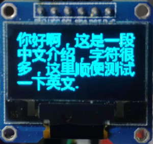

## 1、字库文件生成
全部生成代码位于`make_db`，具体生成步骤见[README文件](make_db/README.MD)
已生成文件位于`build`目录下，该文件可以存储在任意存储上(片上存储、外置SD卡等)，字形数据不占用RAM空间，仅索引占用内存

# 2、字库使用

示例见`main.py`，主要功能类为`ChineseFont.py`，字库文件`font_32.data`，是生成好了的32x32大小的字符bitMap</br>
获取bitmap代码
```python
font_map = font.get_bit_map('我')
```

使用时将`ChineseFont.py`和`font_32.data`拷贝至板子上即可


